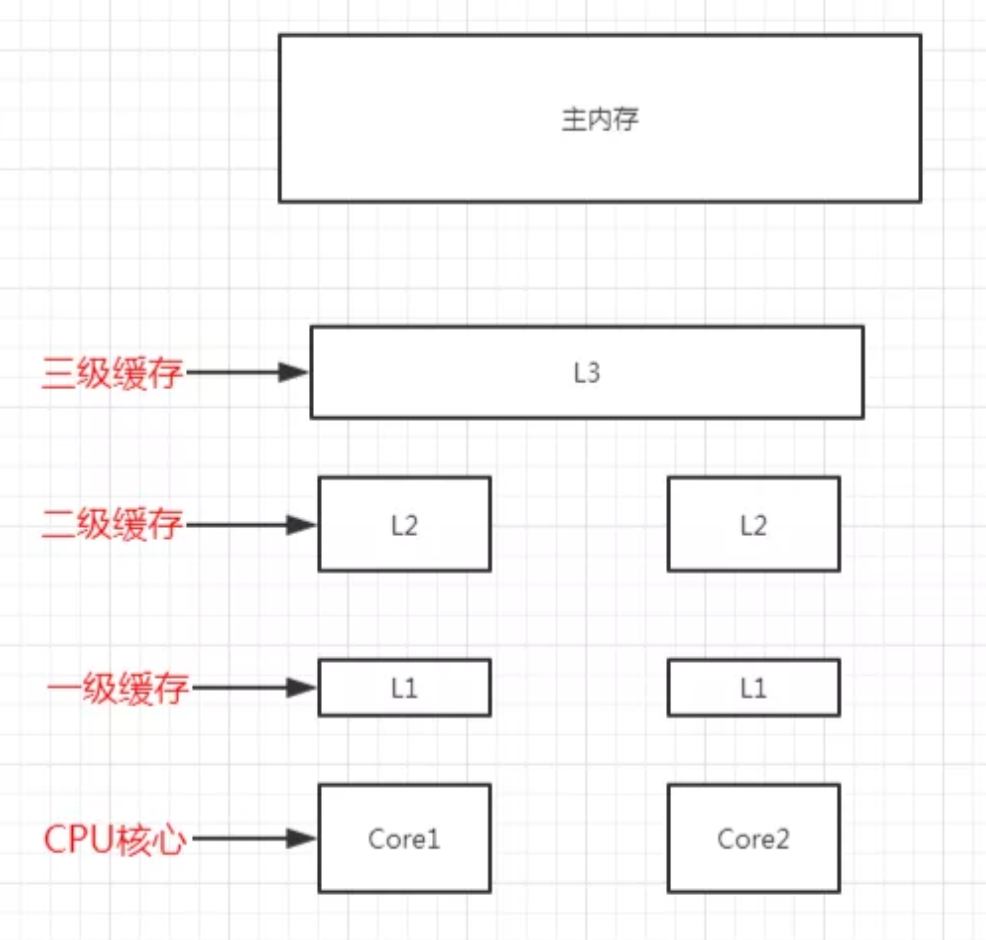

# 原子系列

原子操作是指不会被线程调度机制打断的操作，这种操作一旦开始，就一直运行到结束，中间不会有任何线程上下文切换。原子操作可以是一个步骤，也可以是多个操作步骤，但是其顺序不可以被打乱，也不可以被切割而只执行其中的一部分，将整个操作视作一个整体是原子性的核心特征。

这里文章将其分为四个部分了，下面一个一个来说

## 原子更新基本类型或引用类型

如果是基本类型，则替换其值，如果是引用，则替换其引用地址，这些类主要有：

（1）AtomicBoolean

原子更新布尔类型，内部使用int类型的value存储1和0表示true和false，底层也是对int类型的原子操作。

（2）AtomicInteger

原子更新int类型。

（3）AtomicLong

原子更新long类型。

（4）AtomicReference

原子更新引用类型，通过泛型指定要操作的类。

（5）AtomicMarkableReference

原子更新引用类型，内部使用Pair承载引用对象及是否被更新过的标记，避免了ABA问题。

（6）AtomicStampedReference

原子更新引用类型，内部使用Pair承载引用对象及更新的邮戳，避免了ABA问题。

这几个类的操作基本类似，底层都是调用Unsafe的compareAndSwapXxx()来实现，基本用法如下：

CAS听起来牛逼，其实就是比较加置换罢了，很多地方都有用到

## 原子更新数组中的元素

原子更新数组中的元素，可以更新数组中指定索引位置的元素，这些类主要有

1）AtomicIntegerArray

原子更新int数组中的元素。

（2）AtomicLongArray

原子更新long数组中的元素。

（3）AtomicReferenceArray

原子更新Object数组中的元素。

## 原子更新对象中的字段

原子更新对象中的字段，可以更新对象中指定字段名称的字段，这些类主要有：

（1）AtomicIntegerFieldUpdater

原子更新对象中的int类型字段。

（2）AtomicLongFieldUpdater

原子更新对象中的long类型字段。

（3）AtomicReferenceFieldUpdater

原子更新对象中的引用类型字段。

这里注意对象需要使用volatile关键字

### 高性能原子类

高性能原子类，是java8中增加的原子类，它们使用分段的思想，把不同的线程hash到不同的段上去更新，最后再把这些段的值相加得到最终的值，这些类主要有：

推荐文章：

[Java JUC longAddr](https://juejin.im/post/5d4bde1e5188250541791e45)

[**Java并发编程之LongAdder和LongAccumulator源码探究**](https://www.cnblogs.com/huangjuncong/p/9152510.html)

（1）Striped64

下面四个类的父类。

（2）LongAccumulator

long类型的聚合器，需要传入一个long类型的二元操作，可以用来计算各种聚合操作，包括加乘等。

（3）LongAdder

LongAdder是JDK 1.8 新增的原子类，基于Striped64实现。 从官方文档看，LongAdder在高并发的场景下会比AtomicLong 具有更好的性能，代价是消耗更多的内存空间：

long类型的累加器，LongAccumulator的特例，只能用来计算加法，且从0开始计算。

（4）DoubleAccumulator

double类型的聚合器，需要传入一个double类型的二元操作，可以用来计算各种聚合操作，包括加乘等。

（5）DoubleAdder

double类型的累加器，DoubleAccumulator的特例，只能用来计算加法，且从0开始计算。

## Usafe解析

Unsafe为我们提供了访问底层的机制，这种机制仅供java核心类库使用，而不应该被普通用户使用。

我们发现它有一个属性叫theUnsafe，我们直接通过反射拿到它即可。所以我们普通用户是可以用这个功能的

使用Unsafe的putXXX()方法，我们可以修改任意私有字段的值

### 创建一个实体的集中方法

（1）通过构造方法实例化一个类；

（2）通过Class实例化一个类；

（3）通过反射实例化一个类；

（4）通过克隆实例化一个类；

（5）通过反序列化实例化一个类；

（6）通过Unsafe实例化一个类；

### 总结

使用Unsafe几乎可以操作一切：

（1）实例化一个类；

`Unsafe.allocateInstance()`只会给对象分配内存，并不会调用构造方法，所以如果构造方法里面有任何操作，这是不会执行的。

（2）修改私有字段的值；

​    一旦我们通过反射调用得到字段age，我们就可以使用Unsafe将其值更改为任何其他int值。（当然，这里也可以通过反射直接修改

（3）抛出checked异常；

​    我们知道如果代码抛出了checked异常，要不就使用try...catch捕获它，要不就在方法签名上定义这个异常，但是，通过Unsafe我们可以抛出一个checked异常，同时却不用捕获或在方法签名上定义它。

（4）使用堆外内存；

   如果进程在运行过程中JVM上的内存不足了，会导致频繁的进行GC。理想情况下，我们可以考虑使用堆外内存，这是一块不受JVM管理的内存。使用Unsafe的allocateMemory()我们可以直接在堆外分配内存，这可能非常有用，但我们要记住，这个内存不受JVM管理，因此我们要调用freeMemory()方法手动释放它

（5）CAS操作；

​		JUC下面大量使用了CAS操作，它们的底层是调用的Unsafe的CompareAndSwapXXX()方法。这种方式广泛运用于无锁算法，与java中标准的悲观锁机制相比，它可以利用CAS处理器指令提供极大的加速。比如，我们可以基于Unsafe的compareAndSwapInt()方法构建线程安全的计数器。

（6）阻塞/唤醒线程；

​    JVM在上下文切换的时候使用了Unsafe中的两个非常牛逼的方法park()和unpark()。当一个线程正在等待某个操作时，JVM调用Unsafe的park()方法来阻塞此线程。当阻塞中的线程需要再次运行时，JVM调用Unsafe的unpark()方法来唤醒此线程。我们之前在分析java中的集合时看到了大量的LockSupport.park()/unpark()，它们底层都是调用的Unsafe的这两个方法。

## AtomInteger

AtomicInteger是java并发包下面提供的原子类，主要操作的是int类型的整型，通过调用底层Unsafe的CAS等方法实现原子操作.原子操作可以是一个步骤，也可以是多个操作步骤，但是其顺序不可以被打乱，也不可以被切割而只执行其中的一部分，将整个操作视作一个整体是原子性的核心特征.这里注意，之所以AtomInteger效率比AtomLongAdder低，就是CAS加自旋的乐观锁机制引起的，具体可参见上文文章，所以他会不断得尝试操作，这里和数据库的ACID的A不同的是没有回滚操作。

### 总结

（1）AtomicInteger中维护了一个使用volatile修饰的变量value，保证可见性；

（2）AtomicInteger中的主要方法最终几乎都会调用到Unsafe的compareAndSwapInt()方法保证对变量修改的原子性。

## AtomicStampedReference

AtomicStampedReference是java并发包下提供的一个原子类，它能解决其它原子类无法解决的ABA问题

ABA问题通常发生在无锁结构中

文章中举例了一部分ABA问题，例如常见的栈结构就很经典，如果最后只判断栈顶的话，最后肯定整个结构就不对了。

### 解决ABA问题

（1）版本号

比如，上面的栈结构增加一个版本号用于控制，每次CAS的同时检查版本号有没有变过。还有一些数据结构喜欢使用高位存储一个邮戳来保证CAS的安全。例如AtomStampedRefernce其实对于Markable的话，也是差不多，只是不是维护版本号，而是一个Bool值来判断。

（2）不重复使用节点的引用

比如，执行push()入栈操作的时候新建一个节点传入，而不是复用节点1的引用；

（3）直接操作元素而不是节点

比如，上面的栈结构push()方法不应该传入一个节点（Node），而是传入元素值（int的value）

对于Stamped其实解决方式也是这样

（1）如果元素值和版本号都没有变化，并且和新的也相同，返回true；

（2）如果元素值和版本号都没有变化，并且和新的不完全相同，就构造一个新的Pair对象并执行CAS更新pair。

可以看到，java中的实现跟我们上面讲的ABA的解决方法是一致的。

首先，使用版本号控制；

其次，不重复使用节点（Pair）的引用，每次都新建一个新的Pair来作为CAS比较的对象，而不是复用旧的；

最后，外部传入元素值及版本号，而不是节点（Pair）的引用。

### 总结

（1）在多线程环境下使用无锁结构要注意ABA问题；

（2）ABA的解决一般使用版本号来控制，并保证数据结构使用元素值来传递，且每次添加元素都新建节点承载元素值；

（3）AtomicStampedReference内部使用Pair来存储元素值及其版本号

## 伪共享

我们要明白伪共享，就要知道CPU的缓存架构，CPU我们都知道是计算功能，但是从主内存拿数据还是比较慢，主内存（RAM）是数据存放的地方，CPU 和主内存之间有好几级缓存，因为即使直接访问主内存也是非常慢的。如果对一块数据做相同的运算多次，那么在执行运算的时候把它加载到离 CPU 很近的地方就有意义了，比如一个循环计数，你不想每次循环都跑到主内存去取这个数据来增长它吧



越靠近 CPU 的缓存越快也越小。

所以 L1 缓存很小但很快，并且紧靠着在使用它的 CPU 内核。

L2 大一些，也慢一些，并且仍然只能被一个单独的 CPU 核使用。

L3 在现代多核机器中更普遍，仍然更大，更慢，并且被单个插槽上的所有 CPU 核共享。

最后，主存保存着程序运行的所有数据，它更大，更慢，由全部插槽上的所有 CPU 核共享。

当 CPU 执行运算的时候，它先去 L1 查找所需的数据，再去 L2，然后是 L3，最后如果这些缓存中都没有，所需的数据就要去主内存拿。

走得越远，运算耗费的时间就越长。

所以如果进行一些很频繁的运算，要确保数据在 L1 缓存中。

### CPU 缓存行

缓存是由缓存行组成的，通常是 64 字节（常用处理器的缓存行是 64 字节的，比较旧的处理器缓存行是 32 字节），并且它有效地引用主内存中的一块地址。一个 Java 的 long 类型是 8 字节，因此在一个缓存行中可以存 8 个 long 类型的变量。

在程序运行的过程中，缓存每次更新都从主内存中加载连续的 64 个字节。因此，如果访问一个 long 类型的数组时，当数组中的一个值被加载到缓存中时，另外 7 个元素也会被加载到缓存中。

**但是，如果使用的数据结构中的项在内存中不是彼此相邻的，比如链表，那么将得不到免费缓存加载带来的好处。**

不过，这种免费加载也有一个坏处。设想如果我们有个 long 类型的变量 a，它不是数组的一部分，而是一个单独的变量，并且还有另外一个 long 类型的变量 b 紧挨着它，那么当加载 a 的时候将免费加载 b。

看起来似乎没有什么毛病，但是如果一个 CPU 核心的线程在对 a 进行修改，另一个 CPU 核心的线程却在对 b 进行读取。当前者修改 a 时，会把 a 和 b 同时加载到前者核心的缓存行中，更新完 a 后其它所有包含 a 的缓存行都将失效，因为其它缓存中的 a 不是最新值了。而当后者读取 b 时，发现这个缓存行已经失效了，需要从主内存中重新加载。**请记住，我们的缓存都是以缓存行作为一个单位来处理的，所以失效 a 的缓存的同时，也会把 b 失效，反之亦然。**

这样就出现了一个问题，b 和 a 完全不相干，每次却要因为 a 的更新需要从主内存重新读取，它被缓存未命中给拖慢了。这就是传说中的**伪共享**。

### 伪共享

当多线程修改互相独立的变量时，如果这些变量共享同一个缓存行，就会无意中影响彼此的性能，这就是伪共享。

避免伪共享的方式也很简单，例如我们可以每次加载变量时候，都采用整个8个字节的long去加载，这样避免频繁失效无关变量，文章推荐的是采用

```java
@sun.misc.Contended
class Mylong{
		volatile long value;
}
// 这里是不会生效的，要配置JVM参数-XX:-RestrictContended
```

这里注意在ConcurrentHashMap 中，size是分段构造的，每个段使用的类是 CounterCell，它的类上就有 @sun.misc.Contended 注解。LongAdder 也使用了这个注解避免伪共享

### 伪共享补充

文章中对于一些协议描述不很清楚，这里补充几点关于伪共享的几点知识

参考文章:[伪共享](https://www.cnblogs.com/cyfonly/p/5800758.html)

* 关于SMP system

文章中提到的Cache三层缓存，分别为L1，L2，L3，当然AMD和Intel技术实现细节肯定不一样，`L1 Cache`分为指令缓存和数据缓存两种，`L2 Cache`只存储数据，`L1` 和 `L2` 都是每个核心都有，而 `L3` 被多核共享

* MESI

那么问题来了，多核`CPU`的情况下有多个 L1 和 L2 缓存，如何保证缓存内部数据的一致,不让系统数据混乱。这里就引出了一个一致性的协议`MESI`。

`MESI`规定了一个`cache line`存在四种状态：`Modified`、`Exclusive`、`Shared` 和`Invalid`，这有点像状态机的转换，理清全部的状态较复杂，我们关注简单的：

1. `Modified`：该缓存行只被缓存在该`CPU`的缓存中，并且是被修改过的，即与主存中的数据不一致，该缓存行中的内存需要在未来的某个时间点（允许其它CPU读取请主存中相应内存之前）写回主存。当被写回主存之后，该缓存行的状态会变成`Exclusive`状态。
2. `Exclusive`：该缓存行只被缓存在该`CPU`的缓存中，它是未被修改过的，与主存中数据一致。该状态可以在任何时刻当有其它`CPU`读取该内存时变成`Shared`状态。同样地，当CPU修改该缓存行中内容时，该状态可以变成`Modified`状态。
3. `Shared`：该状态意味着该缓存行可能被多个`CPU`缓存，并且各个缓存中的数据与主存数据一致，当有一个`CPU`修改该缓存行中，其它`CPU`中该缓存行可以被作废。
4. `Invalid`：该缓存是无效的（可能有其它`CPU`修改了该缓存行）。

### 总结

（1）CPU具有多级缓存，越接近CPU的缓存越小也越快；

（2）CPU缓存中的数据是以缓存行为单位处理的；

（3）CPU缓存行能带来免费加载数据的好处，所以处理数组性能非常高；

（4）CPU缓存行也带来了弊端，多线程处理不相干的变量时会相互影响，也就是伪共享；

（5）避免伪共享的主要思路就是让不相干的变量不要出现在同一个缓存行中；

（6）一是每两个变量之间加七个 long 类型；

（7）二是创建自己的 long 类型，而不是用原生的；

（8）三是使用 java8 提供的注解；

## LongAdder

LongAdder是java8中新增的原子类，在多线程环境中，它比AtomicLong性能要高出不少，特别是写多的场景。

### 原理

LongAdder的原理是，在最初无竞争时，只更新base的值，当有多线程竞争时通过分段的思想，让不同的线程更新不同的段，最后把这些段相加就得到了完整的LongAdder存储的值。


LongAdder继承自Striped64抽象类，Striped64中定义了Cell内部类和各重要属性。

Cell类使用@sun.misc.Contended注解，说明是要避免伪共享的。使用Unsafe的CAS更新value的值，其中value的值使用volatile修饰，保证可见性。

**注意**

可以看到sum()方法是把base和所有段的值相加得到，那么，这里有一个问题，如果前面已经累加到sum上的Cell的value有修改，不是就没法计算到了么？答案确实如此，所以LongAdder可以说不是强一致性的，它是最终一致性的。

这里有关强一致性，最终一致性的问题，参见DDIA中第五章叙述

### longAccumulate的扩容

在longAccumulate()方法中有个条件是 `n>=NCPU`就不会走到扩容逻辑了，而n是2的倍数，那是不是代表cells数组最大只能达到大于等于NCPU的最小2次方？答案是明确的。因为同一个CPU核心同时只会运行一个线程，而更新失败了说明有两个不同的核心更新了同一个Cell，这时会重新设置更新失败的那个线程的probe值，这样下一次它所在的Cell很大概率会发生改变，如果运行的时间足够长，最终会出现同一个核心的所有线程都会hash到同一个Cell（大概率，但不一定全在一个Cell上）上去更新，所以，这里cells数组中长度并不需要太长，达到CPU核心数足够了。比如，笔者的电脑是8核的，所以这里cells的数组最大只会到8，达到8就不会扩容了。

### 总结

（1）LongAdder通过base和cells数组来存储值；

（2）不同的线程会hash到不同的cell上去更新，减少了竞争；

（3）LongAdder的性能非常高，最终会达到一种无竞争的状态；

## Footer

本章有个重点代码就是LongAccumulate，里面的实现很精妙，一定要弄懂原理