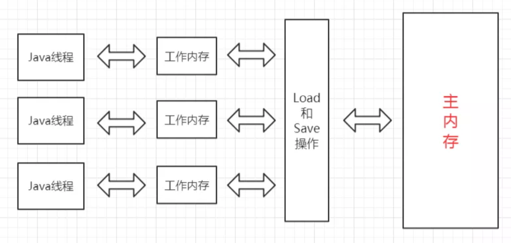

# 同步系列

所谓同步，就是保证多线程（包括多进程）对共享资源的读写能够安全有效的运行。

根据同步的运用场景的不同，实现同步的方式也是随之一起变化，但是总结下来，这些实现方式之间又有一些共通之处。

不管是互斥锁、读写锁、信号量、CountDownLatch、回环栅栏、Phaser，还是各种分布式锁，它们都是基于对同一个**共享变量（状态变量）**的控制，以达到同步的目的。

互斥锁，state为大于等于1（可重入）表示已加锁，state为0表示未加锁；

读写锁，state的高16位存储读的次数，低16位存储写的次数；

信号量，state存储许可的次数，被使用一次许可减一，被释放一次许可加一；

CountDownLatch，state存储初始次数，countDown()次数减一，当次数减为0的时候await()被激活；

回环栅栏，基于ReentrantLock实现，相当于在CountDownLatch的基础上加了“代”的概念，保证可重复使用；

Phaser，state的高32位存储当前阶段phase，中16位存储当前阶段参与者（任务）的数量parties，低16位存储未完成参与者的数量unarrived，每个阶段的参与者都可以控制，相对于回环栅栏更灵活；

mysql分布式锁，基于数据库的getlock()/releaselock()对共享变量进行控制；

zookeeper分布式锁，基于有序临时节点对共享变量进行控制；

redis分布式锁，基于内存键值对对共享变量进行控制；

总结下来，所有同步器的关键因素只有一个——共享变量，只要能够对共享变量进行精确的控制，就能实现同步，以后出现新的组件我们一样可以根据这条原理使用新的组件来实现分布式同步器。


## 前言

### 概览

大致包含三大主题：java中的锁、同步器、分布式锁

（1）volatile

（2）synchronized

（3）AQS及Condition

（4）ReentrantLock

（5）ReentrantReadWriteLock

（6）StampedLock

（7）CountDownLatch

（8）Semaphore

（9）CyclicBarrier

（10）Phaser

（11）Mysql实现分布式锁

（12）Redis实现分布式锁

（13）Zookeeper实现分布锁

### 锁

（1）公平锁/非公平锁

公平锁，是指按照线程申请的顺序获取锁。

非公平锁，是指不是按照线程申请的顺序获取锁，有可能后申请的线程反而先获取到锁，假如先来的线程一直获取不到锁，会造成锁饥饿现象。

ReentrantLock中可以通过构造方法指定是否为公平锁，默认为非公平锁，非公平锁的优点在于吞吐量大。

synchronized无法指定为公平锁，一直都是非公平锁。

（2）可重入锁

可重入锁，是指一个线程获取锁之后再尝试获取锁时会自动获取锁，可重入锁的优点是避免死锁。

ReentrantLock和synchronized都是可重入锁。

（3）独享锁/共享锁

独享锁，是指锁一次只能被一个线程持有。

共享锁，是指锁一次可以被多个线程持有。

ReentrantLock和synchronized都是独享锁，ReadWriteLock的读锁是共享锁，写锁是独享锁。

（4）互斥锁/读写锁

与独享锁/共享锁的概念差不多，是独享锁/共享锁的具体实现。

ReentrantLock和synchronized都是互斥锁

ReadWriteLock是读写锁

（5）乐观锁/悲观锁

悲观锁，是指认为对于同一个数据的并发操作必然会发生修改，即使不会发生修改也这么认为，所以一定要加锁。

乐观锁，是指认为对于同一个数据的并发操作不一定会发生修改，在更新数据的时候，尝试去更新数据，如果失败就不断尝试。

悲观锁适用于写操作多的场景，乐观锁适用于读操作多的场景。

例如CAS 就是乐观锁，而sy就是悲观锁

（6）分段锁

分段锁，是一种锁的设计思路，它细化了锁的粒度，主要运用在ConcurrentHashMap中，实现高效的并发操作，当操作不需要更新整个数组时，就只锁数组中的一项就可以了。LongAddr里面也用到了**分段**思想。

（7）偏向锁/轻量级锁/重量级锁

这三个锁主要是针对synchronized进行优化使用的，主要是通过对象监视器在对象头中的字段来表明的。

偏向锁，是指一段同步代码一直被一个线程访问，那么这个线程会自动获取锁，降低获取锁的代价。

轻量级锁，是指当锁是偏向锁时，被另一个线程所访问，偏向锁会升级为轻量级锁，这个线程会通过自旋的方式尝试获取锁，不会阻塞，提高性能。

重量级锁，是指当锁是轻量级锁时，当自旋的线程自旋了一定的次数后，还没有获取到锁，就会进入阻塞状态，该锁升级为重量级锁，重量级锁会使其他线程阻塞，性能降低。

（8）自旋锁

自旋锁，是指尝试获取锁的线程不会阻塞，而是循环的方式不断尝试，这样的好处是减少线程的上下文切换带来的开锁，提高性能，缺点是循环会消耗CPU。

CAS配合自旋，JUC里面都用了，但是很耗费性能，所以为什么longAdder和LongAccumulate要比AtomLong性能高。

（9）监视器锁

synchronized的实现方式，使用monitorenter和monitorexit来实现。

（10）mutex锁

互斥锁，LockSupport.part()底层是通过mutex实现的。

## JMM（Java内存模型）

Java内存模型是在硬件内存模型上的更高层的抽象，它屏蔽了各种硬件和操作系统之间的差异性，使得Java程序在不同系统不同硬件平台对内存的访问都是一致的。

### 硬件模型

我们都知道，对于计算机而言，CPU是保持计算功能，但是计算还需要存储来辅助，这里的存储介质有很多，比如磁盘、光盘、网卡、内存等，这些存储介质有一个很明显的特点——距离CPU越近的存储介质往往越小越贵越快，距离CPU越远的存储介质往往越大越便宜越慢，CPU大部分时间都浪费在了磁盘IO、网络通讯、数据库访问上，如果不想让CPU在那里白白等待，我们就必须想办法去把CPU的运算能力压榨出来，否则就会造成很大的浪费，而让CPU同时去处理多项任务则是最容易想到的，也是被证明非常有效的压榨手段，这也就是我们常说的“并发执行”。CPU与内存的交互往往是很慢的，所以这就要求我们要想办法在CPU和内存之间建立一种连接，使它们达到一种平衡，让运算能快速地进行，而这种连接就是我们常说的“高速缓存”。

高速缓存的速度是非常接近CPU的，但是它的引入又带来了新的问题，现代的CPU往往是有多个核心的，每个核心都有自己的缓存，而多个核心之间是不存在时间片的竞争的，它们可以并行地执行，那么，怎么保证这些缓存与主内存中的数据的一致性就成为了一个难题。

为了解决缓存一致性的问题，多个核心在访问缓存时要遵循一些协议，在读写操作时根据协议来操作，这些协议有**MSI、MESI、MOSI**等，它们定义了何时应该访问缓存中的数据、何时应该让缓存失效、何时应该访问主内存中的数据等基本原则。

除此之外，为了使CPU中的运算单元能够充分地被利用，CPU可能会对输入的代码进行乱序执行优化，然后在计算之后再将乱序执行的结果进行重组，保证该结果与顺序执行的结果一致，但并不保证程序中各个语句计算的先后顺序与代码的输入顺序一致，因此，如果一个计算任务依赖于另一个计算任务的结果，那么其顺序性并不能靠代码的先后顺序来保证。

与CPU的乱序执行优化类似，**java虚拟机的即时编译器也有类似的指令重排序优化**。

为了解决上面提到的多个缓存读写一致性以及乱序排序优化的问题，这就有了内存模型，它定义了共享内存系统中多线程读写操作行为的规范。

### JMM



Java内存模型（Java Memory Model，JMM）是在硬件内存模型基础上更高层的抽象，它屏蔽了各种硬件和操作系统对内存访问的差异性，从而实现让**Java程序在各种平台下都能达到一致的并发效果**。

Java内存模型定义了程序中各个变量的访问规则，即在虚拟机中将变量存储到内存和从内存中取出这样的底层细节。这里所说的变量包括实例字段、静态字段，但不包括局部变量和方法参数，因为它们是线程私有的，它们不会被共享，自然不存在竞争问题。

为了获得更好的执行效能，Java内存模型并没有限制执行引擎使用处理器的特定寄存器或缓存来和主内存进行交互，也没有限制即时编译器(JIT)调整代码的执行顺序等这类权利。

Java内存模型规定了所有的变量都存储在主内存中，这里的主内存跟介绍硬件时所用的名字一样，两者可以类比，但此处**仅指虚拟机中内存**的一部分。

除了主内存，每条线程还有自己的工作内存，此处可与CPU的高速缓存进行类比。工作内存中保存着该线程使用到的变量的主内存副本的拷贝，线程对变量的操作都必须在工作内存中进行，包括读取和赋值等，而不能直接读写主内存中的变量，不同的线程之间也无法直接访问对方工作内存中的变量，线程间变量值的传递必须通过主内存来完成。

**注意**

这里所说的主内存、工作内存跟Java虚拟机内存区域划分中的堆、栈是不同层次的内存划分，如果两者一定要勉强对应起来，主内存主要对应于堆中对象的实例部分，而工作内存主要对应与虚拟机栈中的部分区域。从更低层次来说，主内存主要对应于硬件内存部分，工作内存主要对应于CPU的高速缓存和寄存器部分，但也不是绝对的，主内存也可能存在于高速缓存和寄存器中，工作内存也可能存在于硬件内存中。


### 内存间的交互作用

我们都知道，在硬件层面上，对于L1，L2，L3和硬件的内存之间常用MESI协议来控制访问，在JVM内存里面也有相应的交互协议，来保证数据的一致。Java内存模型定义了以下8种具体的操作来完成：

（1）lock，锁定，作用于主内存的变量，它把主内存中的变量标识为一条线程独占状态；

（2）unlock，解锁，作用于主内存的变量，它把锁定的变量释放出来，释放出来的变量才可以被其它线程锁定；

（3）read，读取，作用于主内存的变量，它把一个变量从主内存传输到工作内存中，以便后续的load操作使用；

（4）load，载入，作用于工作内存的变量，它把read操作从主内存得到的变量放入工作内存的变量副本中；

（5）use，使用，作用于工作内存的变量，它把工作内存中的一个变量传递给执行引擎，每当虚拟机遇到一个需要使用到变量的值的字节码指令时将会执行这个操作；

（6）assign，赋值，作用于工作内存的变量，它把一个从执行引擎接收到的变量赋值给工作内存的变量，每当虚拟机遇到一个给变量赋值的字节码指令时使用这个操作；

（7）store，存储，作用于工作内存的变量，它把工作内存中一个变量的值传递到主内存中，以便后续的write操作使用；

（8）write，写入，作用于主内存的变量，它把store操作从工作内存得到的变量的值放入到主内存的变量中；

如果要把一个变量从主内存复制到工作内存，那就要按顺序地执行read和load操作，同样地，如果要把一个变量从工作内存同步回主内存，就要按顺序地执行store和write操作。注意，这里只说明了要按顺序，并没有说一定要连续，也就是说可以在read与load之间、store与write之间插入其它操作。比如，对主内存中的变量a和b的访问，可以按照以下顺序执行：

read a -> read b -> load b -> load a。

另外，Java内存模型还定义了执行上述8种操作的基本规则：

1）不允许read和load、store和write操作之一单独出现，即不允许出现从主内存读取了而工作内存不接受，或者从工作内存回写了但主内存不接受的情况出现；

（2）不允许一个线程丢弃它最近的assign操作，即变量在工作内存变化了必须把该变化同步回主内存；

（3）不允许一个线程无原因地（即未发生过assign操作）把一个变量从工作内存同步回主内存；

（4）一个新的变量必须在主内存中诞生，不允许工作内存中直接使用一个未被初始化（load或assign）过的变量，换句话说就是对一个变量的use和store操作之前必须执行过load和assign操作；

（5）一个变量同一时刻只允许一条线程对其进行lock操作，但lock操作可以被同一个线程执行多次，多次执行lock后，只有执行相同次数的unlock操作，变量才能被解锁。

（6）如果对一个变量执行lock操作，将会清空工作内存中此变量的值，在执行引擎使用这个变量前，需要重新执行load或assign操作初始化变量的值；

（7）如果一个变量没有被lock操作锁定，则不允许对其执行unlock操作，也不允许unlock一个其它线程锁定的变量；

（8）对一个变量执行unlock操作之前，必须先把此变量同步回主内存中，即执行store和write操作；

注意，这里的lock和unlock是实现synchronized的基础，Java并没有把lock和unlock操作直接开放给用户使用，但是却提供了**两个更高层次的指令来隐式地使用这两个操作，即moniterenter和moniterexit**。

### 原子性、可见性、有序性

Java内存模型就是为了解决多线程环境下共享变量的一致性问题，一致性主要包含三大特性：原子性、可见性、有序性。

#### 原子性

原子性是指一段操作一旦开始就会一直运行到底，中间不会被其它线程打断，这段操作可以是一个操作，也可以是多个操作。由Java内存模型来直接保证的原子性操作包括**read、load、use、assign、store、write**这几个操作，我们可以大致认为基本类型变量的读写是具备原子性的。如果应用需要一个更大范围的原子性，Java内存模型还提供了lock和unlock这两个操作来满足这种需求，尽管不能直接使用这两个操作，但我们可以使用它们更具体的实现synchronized来实现。因此，synchronized块之间的操作也是原子性的。

####可见性

可见性是指当一个线程修改了共享变量的值，其它线程能立即感知到这种变化。

Java内存模型是通过在变更修改后同步回主内存，在变量读取前从主内存刷新变量值来实现的，它是依赖主内存的，无论是普通变量还是volatile变量都是如此。

普通变量与volatile变量的主要区别是是否会在修改之后立即同步回主内存，以及是否在每次读取前立即从主内存刷新。因此我们可以说volatile变量保证了多线程环境下变量的可见性，但普通变量不能保证这一点。

除了volatile之外，还有两个关键字也可以保证可见性，它们是synchronized和final。

synchronized的可见性是由“对一个变量执行unlock操作之前，必须先把此变量同步回主内存中，即执行store和write操作”这条规则获取的。

final的可见性是指被final修饰的字段在构造器中一旦被初始化完成，那么其它线程中就能看见这个final字段了。

说简单点，就是线程执行是在工作内存里面，各搞各的，如果保障可见行就要在主内存里面保证所有线程能看到这个实时值

#### 有序性

Java程序中天然的有序性可以总结为一句话：**如果在本线程中观察，所有的操作都是有序的；如果在另一个线程中观察，所有的操作都是无序的。**

前半句是指线程内表现为串行的语义，后半句是指“指令重排序”现象和“工作内存和主内存同步延迟”现象。

Java中提供了volatile和synchronized两个关键字来保证有序性。

volatile天然就具有有序性，因为其禁止重排序。

synchronized的有序性是由“一个变量同一时刻只允许一条线程对其进行lock操作”这条规则获取的。

### 先行发生原则（Happens-Before）

如果Java内存模型的有序性都只依靠volatile和synchronized来完成，那么有一些操作就会变得很啰嗦，但是我们在编写Java并发代码时并没有感受到，这是因为Java语言天然定义了一个“先行发生”原则，这个原则非常重要，依靠这个原则我们可以很容易地**判断在并发环境下两个操作是否可能存在竞争冲突问题**。

先行发生，是指操作A先行发生于操作B，那么操作A产生的影响能够被操作B感知到，这种影响包括修改了共享内存中变量的值、发送了消息、调用了方法等。

下面我们看看Java内存模型定义的先行发生原则有哪些：

1）程序次序原则

在一个线程内，按照程序书写的顺序执行，书写在前面的操作先行发生于书写在后面的操作，准确地讲是控制流顺序而不是代码顺序，因为要考虑分支、循环等情况。

（2）监视器锁定原则

一个unlock操作先行发生于后面对同一个锁的lock操作。

（3）volatile原则

对一个volatile变量的写操作先行发生于后面对该变量的读操作。

（4）线程启动原则

对线程的start()操作先行发生于线程内的任何操作。

（5）线程终止原则

线程中的所有操作先行发生于检测到线程终止，可以通过Thread.join()、Thread.isAlive()的返回值检测线程是否已经终止。

（6）线程中断原则

对线程的interrupt()的调用先行发生于线程的代码中检测到中断事件的发生，可以通过Thread.interrupted()方法检测是否发生中断。

（7）对象终结原则

一个对象的初始化完成（构造方法执行结束）先行发生于它的finalize()方法的开始。

（8）传递性原则

如果操作A先行发生于操作B，操作B先行发生于操作C，那么操作A先行发生于操作C。

这里说的“先行发生”与“时间上的先发生”没有必然的关系。

### 总结

（1）硬件内存架构使得我们必须建立内存模型来保证多线程环境下对共享内存访问的正确性；

（2）Java内存模型定义了保证多线程环境下共享变量一致性的规则；

（3）Java内存模型提供了工作内存与主内存交互的8大操作：lock、unlock、read、load、use、assign、store、write；

（4）Java内存模型对原子性、可见性、有序性提供了一些实现；

（5）先行发生的8大原则：程序次序原则、监视器锁定原则、volatile原则、线程启动原则、线程终止原则、线程中断原则、对象终结原则、传递性原则；

（6）先行发生不等于时间上的先发生；

## volatile

volatile可以说是Java虚拟机提供的最轻量级的同步机制了，但是它并不容易被正确地理解，以至于很多人不习惯使用它，遇到多线程问题一律使用synchronized或其它锁来解决。了解volatile的语义对理解多线程的特性具有很重要的意义。对于volatile，最典型的两点一个是禁止指令重排序，一个是可见行

### 可见性

可见性是指当一个线程修改了共享变量的值，其它线程能立即感知到这种变化。而普通变量无法做到立即感知这一点，变量的值在线程之间的传递均需要通过主内存来完成，比如，线程A修改了一个普通变量的值，然后向主内存回写，另外一条线程B只有在线程A的回写完成之后再从主内存中读取变量的值，才能够读取到新变量的值，也就是新变量才能对线程B可见。在这期间可能会出现不一致的情况。

java内存模型规定，volatile变量的每次修改都必须立即回写到主内存中，volatile变量的每次使用都必须从主内存刷新最新的值。

### 禁止指令重排序

如果在本线程中观察，所有的操作都是有序的；如果在另一个线程中观察，所有的操作都是无序的。前半句是指线程内表现为串行的语义，后半句是指“指令重排序”现象和“工作内存和主内存同步延迟”现象。

重排序是站在另一个线程的视角的，因为在本线程中，是无法感知到重排序的影响的。而volatile变量是禁止重排序的，它能保证程序实际运行是按代码顺序执行的。

### 实现：内存屏障

推荐了三篇文章，不过都是英文的

### 缺陷

我们都知道，关于内存操作里面要保证三大特性，volatile关键字可以保证可见性和有序性，但是却不满足原子性。所以我们在使用volatile的场景时候要满足

（1）运算的结果并不依赖于变量的当前值，或者能够确保只有单一的线程修改变量的值；

（2）变量不需要与其他状态变量共同参与不变约束。

说白了，就是volatile本身不保证原子性，那就要增加其它的约束条件来使其所在的场景本身就是原子的。

### 总结

（1）volatile关键字可以保证可见性；

（2）volatile关键字可以保证有序性；

（3）volatile关键字不可以保证原子性；

（4）volatile关键字的底层主要是通过内存屏障来实现的；

（5）volatile关键字的使用场景必须是场景本身就是原子的；

## synchronized

synchronized关键字是Java里面最基本的同步手段，它经过编译之后，会在同步块的前后分别生成 monitorenter 和 monitorexit 字节码指令，这两个字节码指令都需要一个引用类型的参数来指明要锁定和解锁的对象。

### 实现原理

lock，锁定，作用于主内存的变量，它把主内存中的变量标识为一条线程独占状态。

unlock，解锁，作用于主内存的变量，它把锁定的变量释放出来，释放出来的变量才可以被其它线程锁定。

但是这两个指令并没有直接提供给用户使用，而是提供了两个更高层次的指令 **monitorenter 和 monitorexit** 来隐式地使用 lock 和 unlock 指令。

而 synchronized 就是使用 monitorenter 和 monitorexit 这两个指令来实现的。

根据JVM规范的要求，在执行monitorenter指令的时候，首先要去尝试获取对象的锁，如果这个对象没有被锁定，或者当前线程已经拥有了这个对象的锁，就把锁的计数器加1，相应地，在执行monitorexit的时候会把计数器减1，当计数器减小为0时，锁就释放了。

### 原子性、可见性、有序性

还是回到Java内存模型上来，synchronized关键字底层是通过monitorenter和monitorexit实现的，而这两个指令又是通过lock和unlock来实现的。

而lock和unlock在Java内存模型中是必须满足下面四条规则的：

（1）一个变量同一时刻只允许一条线程对其进行lock操作，但lock操作可以被同一个线程执行多次，多次执行lock后，只有执行相同次数的unlock操作，变量才能被解锁。

（2）如果对一个变量执行lock操作，将会清空工作内存中此变量的值，在执行引擎使用这个变量前，需要重新执行load或assign操作初始化变量的值；

（3）如果一个变量没有被lock操作锁定，则不允许对其执行unlock操作，也不允许unlock一个其它线程锁定的变量；

（4）对一个变量执行unlock操作之前，必须先把此变量同步回主内存中，即执行store和write操作；

通过规则（1），我们知道对于lock和unlock之间的代码，同一时刻只允许一个线程访问，所以，synchronized是具有原子性的。

通过规则（1）（2）和（4），我们知道每次lock和unlock时都会从主内存加载变量或把变量刷新回主内存，而lock和unlock之间的变量（这里是指锁定的变量）是不会被其它线程修改的，所以，synchronized是具有可见性的。

通过规则（1）和（3），我们知道所有对变量的加锁都要排队进行，且其它线程不允许解锁当前线程锁定的对象，所以，synchronized是具有有序性的。

综上所述，synchronized是可以保证原子性、可见性和有序性的。

### 公平锁 VS 非公平锁

synchronized是可重入的，并且是非公平的，也就是说，你在写多个线程时候，synchronized并不会按照你写的顺序执行，而是会形成一个竞争态势

当然synchronized也是在不断进化的

Java在不断进化，同样地，Java中像synchronized这种古老的东西也在不断进化，比如ConcurrentHashMap在jdk7的时候还是使用ReentrantLock加锁的，在jdk8的时候已经换成了原生的synchronized了，可见synchronized有原生的支持，它的进化空间还是很大的。

那么，synchronized有哪些进化中的状态呢？

我们这里稍做一些简单地介绍：

（1）偏向锁，是指一段同步代码一直被一个线程访问，那么这个线程会自动获取锁，降低获取锁的代价。

（2）轻量级锁，是指当锁是偏向锁时，被另一个线程所访问，偏向锁会升级为轻量级锁，这个线程会通过自旋的方式尝试获取锁，不会阻塞，提高性能。

（3）重量级锁，是指当锁是轻量级锁时，当自旋的线程自旋了一定的次数后，还没有获取到锁，就会进入阻塞状态，该锁升级为重量级锁，重量级锁会使其他线程阻塞，性能降低。

### 注意点

* 我们知道synchronized是需要一个引用类型的参数的，而这个引用类型的参数在Java中其实可以分成三大类：类对象、实例对象、普通引用
* 在方法上使用synchronized的时候要注意，会隐式传参，分为静态方法和非静态方法，静态方法上的隐式参数为当前类对象，非静态方法上的隐式参数为当前实例this
* 多个synchronized只有锁的是同一个对象，它们之间的代码才是同步的，这一点在使用synchronized的时候一定要注意

### 总结

（1）synchronized在编译时会在同步块前后生成monitorenter和monitorexit字节码指令；

（2）monitorenter和monitorexit字节码指令需要一个引用类型的参数，基本类型不可以哦；

（3）monitorenter和monitorexit字节码指令更底层是使用Java内存模型的lock和unlock指令；

（4）synchronized是可重入锁；

（5）synchronized是非公平锁；

（6）synchronized可以同时保证原子性、可见性、有序性；

（7）synchronized有三种状态：偏向锁、轻量级锁、重量级锁；

## 实现锁

自己实现锁是AQS的基础，这个必须搞明白，并且能分析他是否可重入是否公平，保证原子可见有序等基本功能

学习synchronized的时候我们说过它的实现原理是更改对象头中的MarkWord，标记为已加锁或未加锁

但是，我们自己是无法修改对象头信息的，那么我们可不可以用一个变量来代替呢

其次，我们要保证多个线程对上面我们定义的变量的争用是可控的，所谓可控即同时只能有一个线程把它的值修改为1，且当它的值为1的时候其它线程不能再修改它的值，这种是不是就是典型的CAS操作，所以我们需要使用Unsafe这个类来做CAS操作。

然后，我们知道在多线程的环境下，多个线程对同一个锁的争用肯定只有一个能成功，那么，其它的线程就要排队，所以我们还需要一个队列。

最后，这些线程排队的时候干嘛呢？它们不能再继续执行自己的程序，那就只能阻塞了，阻塞完了当轮到这个线程的时候还要唤醒，所以我们还需要Unsfae这个类来阻塞（park）和唤醒（unpark）线程。

所以集齐这几点，基本就没有什么问题，我们需要一个变量、一个队列、执行CAS/park/unpark的Unsafe类。


### 总结

（1）自己动手写一个锁需要做准备：一个变量、一个队列、Unsafe类。

（2）原子更新变量为1说明获得锁成功；

（3）原子更新变量为1失败说明获得锁失败，进入队列排队；

（4）更新队列尾节点的时候是多线程竞争的，所以要使用原子更新；

（5）更新队列头节点的时候只有一个线程，不存在竞争，所以不需要使用原子更新；

（6）队列节点中的前一个节点prev的使用很巧妙，没有它将很难实现一个锁

**注意**

（1）我们实现的锁支持可重入吗？

**可重入锁**：**可重入锁指的是在一个线程中可以多次获取同一把锁，比如：一个线程在执行一个带锁的方法，该方法中又调用了另一个需要相同锁的方法，则该线程可以直接执行调用的方法，而无需重新获得锁；**

答：不可重入，因为我们每次只把state更新为1。如果要支持可重入也很简单，获取锁时检测锁是不是被当前线程占有着，如果是就把state的值加1，释放锁时每次减1即可，减为0时表示锁已释放。

（2）我们实现的锁是公平锁还是非公平锁？

公平锁就是按照队列严格执行顺序，而不是在交接的时候发生抢占，造成可能有的线程一直获取不到锁这种情况，也就是饥饿现象。

答：非公平锁，因为获取锁的时候我们先尝试了一次，这里并不是严格的排队，所以是非公平锁。

**对于可重入锁的一个场景**：用户名和密码保存在本地txt文件中，则登录验证方法和更新密码方法都应该被加synchronized，那么当更新密码的时候需要验证密码的合法性，所以需要调用验证方法，此时是可以调用的。

## AQS

AQS基本阿里面试必问了大概，所以一定要弄懂到源码水平

AQS的全称是AbstractQueuedSynchronizer，它的定位是为Java中几乎所有的锁和同步器提供一个基础框架。AQS是基于FIFO的队列实现的，并且内部维护了一个状态变量state，通过原子更新这个状态变量state即可以实现加锁解锁操作。

我们知道AQS全称AbstractQueuedSynchronizer，说明他是一个抽象类，本质是需要一个子类来实现他的

```java
// 互斥模式下使用：尝试获取锁
protected boolean tryAcquire(int arg) {
        throw new UnsupportedOperationException();
    }
 // 互斥模式下使用：尝试释放锁
 protected boolean tryRelease(int arg) {
        throw new UnsupportedOperationException();
    }
// 共享模式下使用：尝试获取锁
protected int tryAcquireShared(int arg) {
        throw new UnsupportedOperationException();
    }
// 共享模式下使用：尝试释放锁
protected boolean tryReleaseShared(int arg) {
        throw new UnsupportedOperationException();
    }
// 如果当前线程持有锁，返回true
protected boolean isHeldExclusively() {
        throw new UnsupportedOperationException();
    }
```

这几个方法为什么不直接定义成抽象方法呢？因为子类只要实现这几个方法中的一部分就可以实现一个同步器了，所以不需要定义成抽象方法。

### 总结

（1）AQS是Java中几乎所有锁和同步器的一个基础框架，这里说的是“几乎”，因为有极个别确实没有通过AQS来实现；

（2）AQS中维护了一个队列，这个队列使用双链表实现，用于保存等待锁排队的线程；

（3）AQS中维护了一个状态变量，控制这个状态变量就可以实现加锁解锁操作了；

（4）基于AQS自己动手写一个锁非常简单，只需要实现AQS的几个方法即可。

## ReentrantLock（特别条件锁这里着重看下源码逻辑）

ReentrantLock翻译是重入锁，但是并不是意味着他是唯一的重入锁，比如Sysntronized这个也是重入锁

重入锁概念在上一张有阐述，就是一个线程获取锁之后再尝试获取锁时会自动获取锁，这种方式是防止死锁发生

ReentrantLock实现了Lock接口，Lock接口里面定义了java中锁应该实现的几个方法，通过源码可以看到，他实现了Serialized和Lock接口

Lock接口中主要定义了 **获取锁、尝试获取锁、释放锁、条件锁**等几个方法

ReentrantLock中主要定义了三个内部类：Sync、NonfairSync、FairSync

（1）抽象类Sync实现了AQS的部分方法；

（2）NonfairSync实现了Sync，主要用于非公平锁的获取；

（3）FairSync实现了Sync，主要用于公平锁的获取

如果不指定，默认是采用非公平锁的方式实现，指定公平锁创建的时候赋值为True

### 公平锁获取方式

（1）尝试获取锁，如果获取到了就直接返回了；

（2）尝试获取锁失败，再调用addWaiter()构建新节点并把新节点入队；

（3）然后调用acquireQueued()再次尝试获取锁，如果成功了，直接返回；

（4）如果再次失败，再调用shouldParkAfterFailedAcquire()将节点的等待状态置为等待唤醒（SIGNAL）；

（5）调用parkAndCheckInterrupt()阻塞当前线程；

（6）如果被唤醒了，会继续在acquireQueued()的for()循环再次尝试获取锁，如果成功了就返回；

（7）如果不成功，再次阻塞，重复（3）（4）（5）直到成功获取到锁。

### 非公平锁

相对于公平锁，非公平锁加锁的过程主要有两点不同：

（1）一开始就尝试CAS更新状态变量state的值，如果成功了就获取到锁了；

（2）在tryAcquire()的时候没有检查是否前面有排队的线程，直接上去获取锁才不管别人有没有排队呢；

总的来说，相对于公平锁，非公平锁在一开始就多了两次直接尝试获取锁的过程。

### 注意点

* ReentrantLock支持线程中断，它与lock()方法的主要区别在于lockInterruptibly()获取锁的时候如果线程中断了，会抛出一个异常，而lock()不会管线程是否中断都会一直尝试获取锁，获取锁之后把自己标记为已中断，继续执行自己的逻辑，后面也会正常释放锁。

* ReentrantLock默认是采用非公平锁的，因为非公平模式效率比较高，非公平模式会在一开始就尝试两次获取锁，如果当时正好state的值为0，它就会成功获取到锁，少了排队导致的阻塞/唤醒过程，并且减少了线程频繁的切换带来的性能损耗，但是非公平锁也有很大的弊端，有可能会导致一开始排队的线程一直获取不到锁，导致线程饿死

### 条件锁

这里注意，我们上次自己实现了锁是通过一个共享变量，Unsafe的CAS加上唤醒/阻塞线程以及一个队列实现的，这是很多JUC的基础，相比于ReentrantLock我们少了条件锁也就是Condition

条件锁，是指在**获取锁之后**发现当前业务场景自己无法处理，而需要等待某个条件的出现才可以继续处理时使用的一种锁。必须是**在获取锁之后去等待**，对应到ReentrantLock的条件锁，就是获取锁之后才能调用condition.await()方法。在java中，条件锁的实现都在AQS的ConditionObject类中，ConditionObject实现了Condition接口。

#### ConditionObject

条件锁中也维护了一个队列，为了和AQS的队列区分，我这里称为条件队列，firstWaiter是队列的头节点，lastWaiter是队列的尾节点。新建一个条件锁最后就是调用的AQS中的ConditionObject类来实例化条件锁。

**注意**

* Condition的队列和AQS的队列不完全一样；

1. `AQS的队列头节点是不存在任何值的，是一个虚节点；`
2. `Condition的队列头节点是存储着实实在在的元素值的，是真实节点。`

* 各种等待状态（waitStatus）的变化

1. `首先，在条件队列中，新建节点的初始等待状态是CONDITION（-2）；`
2. `其次，移到AQS的队列中时等待状态会更改为0（AQS队列节点的初始等待状态为0）；`
3. `然后，在AQS的队列中如果需要阻塞，会把它上一个节点的等待状态设置为SIGNAL（-1）；`
4. `最后，不管在Condition队列还是AQS队列中，已取消的节点的等待状态都会设置为CANCELLED（1）；`
5. `另外，后面我们在共享锁的时候还会讲到另外一种等待状态叫PROPAGATE（-3）。`

* 相似的名称

1. `AQS中下一个节点是next，上一个节点是prev；`
2. `Condition中下一个节点是nextWaiter，没有上一个节点。`

await方法过程

（1）新建一个节点加入到条件队列中去；

（2）完全释放当前线程占有的锁；

（3）阻塞当前线程，并等待条件的出现；

（4）条件已出现（此时节点已经移到AQS的队列中），尝试获取锁；

也就是说await()方法内部其实是 `先释放锁->等待条件->再次获取锁`的过程。

### ReentrantLock VS syntronized

synchronized是Java原生提供的用于在多线程环境中保证同步的关键字，底层是通过修改对象头中的MarkWord来实现的。

ReentrantLock是Java语言层面提供的用于在多线程环境中保证同步的类，底层是通过原子更新状态变量state来实现的。

对比

| 功能                     | ReentrantLock                                                | synchronized                                          |
| :----------------------- | :----------------------------------------------------------- | :---------------------------------------------------- |
| 可重入                   | 支持                                                         | 支持                                                  |
| 非公平                   | 支持（默认）                                                 | 支持                                                  |
| 加锁/解锁方式            | 需要手动加锁、解锁，一般使用try..finally..保证锁能够释放     | 手动加锁，无需刻意解锁                                |
| 按key锁                  | 不支持，比如按用户id加锁                                     | 支持，synchronized加锁时需要传入一个对象              |
| 公平锁                   | 支持，new ReentrantLock(true)                                | 不支持                                                |
| 中断                     | 支持，lockInterruptibly()                                    | 不支持                                                |
| 尝试加锁                 | 支持，tryLock()                                              | 不支持                                                |
| 超时锁                   | 支持，tryLock(timeout, unit)                                 | 不支持                                                |
| 获取当前线程获取锁的次数 | 支持，getHoldCount()                                         | 不支持                                                |
| 获取等待的线程           | 支持，getWaitingThreads()                                    | 不支持                                                |
| 检测是否被当前线程占有   | 支持，isHeldByCurrentThread()                                | 不支持                                                |
| 检测是否被任意线程占有   | 支持，isLocked()                                             | 不支持                                                |
| 条件锁                   | 可支持多个条件，condition.await()，condition.signal()，condition.signalAll() | 只支持一个，obj.wait()，obj.notify()，obj.notifyAll() |

随着线程数的不断增加，synchronized的效率比ReentrantLock非公平模式要高！

这在JDK 8上有所体现，将synchronized进行了极大的优化，包括现在concurrentHashMap 已经将ReentrantLock替换为synchronized。如果不是非必须情况，推荐还是使用syntronlized一个是简单，一个是效率也高。

### 总结

（1）重入锁是指可重复获取的锁，即一个线程获取锁之后再尝试获取锁时会自动获取锁；

（2）在ReentrantLock中重入锁是通过不断累加state变量的值实现的；

（3）ReentrantLock的释放要跟获取匹配，即获取了几次也要释放几次；

（4）ReentrantLock默认是非公平模式，因为非公平模式效率更高；

（5）条件锁是指为了等待某个条件出现而使用的一种锁；

（6）条件锁比较经典的使用场景就是队列为空时阻塞在条件notEmpty上；

（7）ReentrantLock中的条件锁是通过AQS的ConditionObject内部类实现的；

（8）await()和signal()方法都必须在获取锁之后释放锁之前使用；

（9）await()方法会新建一个节点放到条件队列中，接着完全释放锁，然后阻塞当前线程并等待条件的出现；

（10）signal()方法会寻找条件队列中第一个可用节点移到AQS队列中；

（11）在调用signal()方法的线程调用unlock()方法才真正唤醒阻塞在条件上的节点（此时节点已经在AQS队列中）；

（12）之后该节点会再次尝试获取锁，后面的逻辑与lock()的逻辑基本一致了。

### 场景

参考：[ReentrantLock可重入锁的使用场景](https://my.oschina.net/noahxiao/blog/101558)

## ReentrantReadWriteLock

### 读写锁

读写锁是一种特殊的锁，它把对共享资源的访问分为读访问和写访问，多个线程可以同时对共享资源进行读访问，但是同一时间只能有一个线程对共享资源进行写访问，使用读写锁可以极大地提高并发量。读写锁除了读读不互斥，读写、写读、写写都是互斥的。也就是多个线程可以一起读，读写是不可以的，写写也不行。

（1）ReentrantReadWriteLock本身实现了ReadWriteLock接口，这个接口只提供了两个方法 `readLock()`和 `writeLock（）`；

（2）同步器，包含一个继承了AQS的Sync内部类，以及其两个子类FairSync和NonfairSync；

（3）ReadLock和WriteLock两个内部类实现了Lock接口，它们具有锁的一些特性。

### 注意点

**同一个线程先读后写和先写后读是完全不一样**

先读后写，一个线程占有读锁后，其它线程还是可以占有读锁的，这时候如果在其它线程占有读锁之前让自己占有了写锁，其它线程又不能占有读锁了，这段程序会非常难实现，逻辑也很奇怪，所以，**设计成只要一个线程占有了读锁，其它线程包括它自己都不能再获取写锁**。

先写后读，一个线程占有写锁后，其它线程是不能占有任何锁的，这时候，即使自己占有一个读锁，对程序的逻辑也不会有任何影响，所以，一个线程占有写锁后是可以再占有读锁的，只是这个时候其它线程依然无法获取读锁。

如果你仔细思考上面的逻辑，你会发现一个线程先占有读锁后占有写锁，会有一个很大的问题——锁无法被释放也无法被获取了。这个线程先占有了读锁，然后自己再占有写锁的时候会阻塞，然后它就自己把自己搞死了，进而把其它线程也搞死了，它无法释放锁，其它线程也无法获得锁了

## Semaphore

Semaphore，信号量，它保存了一系列的许可（permits），每次调用acquire()都将消耗一个许可，每次调用release()都将归还一个许可。

Semaphore通常用于限制同一时间对共享资源的访问次数上，也就是常说的限流。

Semaphore中包含了一个实现了AQS的同步器Sync，以及它的两个子类FairSync和NonFairSync，这说明Semaphore也是区分公平模式和非公平模式的

### 总结

（1）Semaphore，也叫信号量，通常用于控制同一时刻对共享资源的访问上，也就是限流场景；

（2）Semaphore的内部实现是基于AQS的共享锁来实现的；

（3）Semaphore初始化的时候需要指定许可的次数，许可的次数是存储在state中；

（4）获取一个许可时，则state值减1；

（5）释放一个许可时，则state值加1；

（6）可以动态减少n个许可；

（7）可以动态增加n个许可吗？

**调用release(int permits)即可**。我们知道释放许可的时候state的值会相应增加，再回头看看释放许可的源码，发现与ReentrantLock的释放锁还是有点区别的，Semaphore释放许可的时候并不会检查当前线程有没有获取过许可，所以可以调用释放许可的方法动态增加一些许可

限流场景：限流，即在流量突然增大的时候，上层要能够限制住突然的大流量对下游服务的冲击，在分布式系统中**限流一般做在网关层**，当然在个别功能中也可以自己简单地来限流，比如**秒杀场景**，假如只有10个商品需要秒杀，那么，服务本身可以限制同时只进来100个请求，其它请求全部作废，这样服务的压力也不会太大。

## CountDownLatch

CountDownLatch，可以翻译为倒计时器，但是似乎不太准确，它的含义是**允许一个或多个线程等待其它线程的操作执行完毕后再执行后续的操作**。

CountDownLatch的通常用法和Thread.join()有点类似，等待其它线程都完成后再执行主任务

CountDownLatch中只包含了Sync一个内部类，它没有公平/非公平模式，所以它算是一个比较简单的同步器了。

这里还要注意一点，CountDownLatch没有实现Serializable接口，所以它不是可序列化的

### await

await()方法是等待其它线程完成的方法，它会先尝试获取一下共享锁，如果失败则进入AQS的队列中排队等待被唤醒。根据上面Sync的源码，我们知道，state不等于0的时候tryAcquireShared()返回的是-1，也就是说count未减到0的时候所有调用await()方法的线程都要排队。

### countDown

countDown()方法，会释放一个共享锁，也就是count的次数会减1。根据上面Sync的源码，我们知道，tryReleaseShared()每次会把count的次数减1，当其减为0的时候返回true，这时候才会唤醒等待的线程

### 注意

* 前面我们学习Semaphore的时候发现，它的许可次数是可以随时调整的，那么，CountDownLatch的初始次数能随时调整吗？答案是不能的，它没有提供修改（增加或减少）次数的方法，除非使用反射作弊

* Thread.join()是在主线程中调用的，它只能等待被调用的线程结束了才会通知主线程，而CountDownLatch则不同，它的countDown()方法可以在线程执行的任意时刻调用，灵活性更大

* 前面我们分析ReentrantReadWriteLock的时候学习过AQS的共享锁模式，比如当前锁是由一个线程获取为互斥锁，那么这时候所有需要获取共享锁的线程都要进入AQS队列中进行排队，当这个互斥锁释放的时候，会一个接着一个地唤醒这些连续的排队的等待获取共享锁的线程，注意，这里的用语是“一个接着一个地唤醒”，也就是说这些等待获取共享锁的线程不是一次性唤醒的。

  说到这里，是不是很明白了？因为CountDownLatch的await()多个线程可以调用多次，当调用多次的时候这些线程都要进入AQS队列中排队，当count次数减为0的时候，它们都需要被唤醒，继续执行任务，如果使用互斥锁则不行，互斥锁在多个线程之间是互斥的，一次只能唤醒一个，不能保证当count减为0的时候这些调用了await()方法等待的线程都被唤醒

### 总结

（1）CountDownLatch表示允许一个或多个线程等待其它线程的操作执行完毕后再执行后续的操作；

（2）CountDownLatch使用**AQS的共享锁**机制实现；

（3）CountDownLatch初始化的时候需要传入次数count；

（4）每次调用countDown()方法count的次数减1；

（5）每次调用await()方法的时候会尝试获取锁，这里的获取锁其实是检查AQS的state变量的值是否为0；

（6）当count的值（也就是state的值）减为0的时候会唤醒排队着的线程（这些线程调用await()进入队列）；

## StampedLock

StampedLock是java8中新增的类，它是一个更加高效的读写锁的实现，而且它不是基于AQS来实现的，它的内部自成一片逻辑，让我们一起来学习吧。

StampedLock具有三种模式：写模式、读模式、乐观读模式。

ReentrantReadWriteLock中的读和写都是一种悲观锁的体现，StampedLock加入了一种新的模式——乐观读，它是指当乐观读时假定没有其它线程修改数据，读取完成后再检查下版本号有没有变化，没有变化就读取成功了，这种模式更适用于读多写少的场景

### 与ReentrantReadWriteLock对比

**源码对比**

（1）写锁的使用方式基本一致；

（2）读锁（悲观）的使用方式可以进行升级，通过tryConvertToWriteLock()方式可以升级为写锁；

（3）乐观读锁是一种全新的方式，它假定数据没有改变，**乐观读之后处理完业务逻辑再判断**版本号是否有改变，如果没改变则乐观读成功，如果有改变则转化为悲观读锁重试；

**总结**

（1）两者都有获取读锁、获取写锁、释放读锁、释放写锁的方法，这是相同点；

（2）两者的结构基本类似，都是使用state + CLH队列；

（3）前者的state分成三段，高24位存储版本号、低7位存储读锁被获取的次数、第8位存储写锁被获取的次数；

（4）后者的state分成两段，高16位存储读锁被获取的次数，低16位存储写锁被获取的次数；

（5）前者的CLH队列可以看成是变异的CLH队列，连续的读线程只有首个节点存储在队列中，其它的节点存储的首个节点的cowait栈中；

（6）后者的CLH队列是正常的CLH队列，所有的节点都在这个队列中；

（7）前者获取锁的过程中有判断首尾节点是否相同，也就是是不是快轮到自己了，如果是则不断自旋，所以适合执行短任务；

（8）后者获取锁的过程中非公平模式下会做有限次尝试；

（9）前者只有非公平模式，一上来就尝试获取锁；

（10）前者唤醒读锁是一次性唤醒连续的读锁的，而且其它线程还会协助唤醒；

（11）后者是一个接着一个地唤醒的；

（12）前者有乐观读的模式，乐观读的实现是通过判断state的高25位是否有变化来实现的；

（13）前者各种模式可以互转，类似tryConvertToXxx()方法；

（14）前者写锁不可重入，后者写锁可重入；

（15）前者无法实现条件锁，后者可以实现条件锁；

### 总结

（1）StampedLock也是一种读写锁，它不是基于AQS实现的；

（2）StampedLock相较于ReentrantReadWriteLock多了一种乐观读的模式，以及读锁转化为写锁的方法；

（3）StampedLock的state存储的是版本号，确切地说是高24位存储的是版本号，写锁的释放会增加其版本号，读锁不会；

（4）StampedLock的低7位存储的读锁被获取的次数，第8位存储的是写锁被获取的次数；

（5）StampedLock不是可重入锁，因为只有第8位标识写锁被获取了，并不能重复获取；

（6）StampedLock中获取锁的过程使用了大量的自旋操作，对于短任务的执行会比较高效，长任务的执行会浪费大量CPU；

（7）StampedLock不能实现条件锁；

## CyclicBarrier

CyclicBarrier，回环栅栏，它会阻塞一组线程直到这些线程同时达到某个条件才继续执行。它与CountDownLatch很类似，但又不同，CountDownLatch需要调用countDown()方法触发事件，而CyclicBarrier不需要，它就像一个栅栏一样，当一组线程都到达了栅栏处才继续往下走。


## CyclicBarrier与CountDownLatch的异同

（1）两者都能实现阻塞一组线程等待被唤醒；

（2）前者是最后一个线程到达时自动唤醒；

（3）后者是通过显式地调用countDown()实现的；

（4）前者是通过重入锁及其条件锁实现的，后者是直接基于AQS实现的；

（5）前者具有“代”的概念，可以重复使用，后者只能使用一次；

（6）前者只能实现多个线程到达栅栏处一起运行；

（7）后者不仅可以实现多个线程等待一个线程条件成立，还能实现一个线程等待多个线程条件成立

## 总结

（1）CyclicBarrier会使一组线程阻塞在await()处，当最后一个线程到达时唤醒（只是从条件队列转移到AQS队列中）前面的线程大家再继续往下走；

（2）CyclicBarrier不是直接使用AQS实现的一个同步器；

（3）CyclicBarrier基于ReentrantLock及其Condition实现整个同步逻辑；

## Phaser

Phaser，翻译为阶段，它适用于这样一种场景，一个大任务可以分为多个阶段完成，且每个阶段的任务可以多个线程并发执行，但是必须上一个阶段的任务都完成了才可以执行下一个阶段的任务。

这种场景虽然使用CyclicBarrier或者CountryDownLatch也可以实现，但是要复杂的多。首先，具体需要多少个阶段是可能会变的，其次，每个阶段的任务数也可能会变的。相比于CyclicBarrier和CountDownLatch，Phaser更加灵活更加方便

## 对比

Phaser相对于CyclicBarrier和CountDownLatch的优势？

答：优势主要有两点：

（1）Phaser可以完成多阶段，而一个CyclicBarrier或者CountDownLatch一般只能控制一到两个阶段的任务；

（2）Phaser每个阶段的任务数量可以控制，而一个CyclicBarrier或者CountDownLatch任务数量一旦确定不可修改。

## 总结

（1）Phaser适用于多阶段多任务的场景，每个阶段的任务都可以控制得很细；

（2）Phaser内部使用state变量及队列实现整个逻辑

（3）state的高32位存储当前阶段phase，中16位存储当前阶段参与者（任务）的数量parties，低16位存储未完成参与者的数量unarrived；

（4）队列会根据当前阶段的奇偶性选择不同的队列；

（5）当不是最后一个参与者到达时，会自旋或者进入队列排队来等待所有参与者完成任务；

（6）当最后一个参与者完成任务时，会唤醒队列中的线程并进入下一个阶段；

