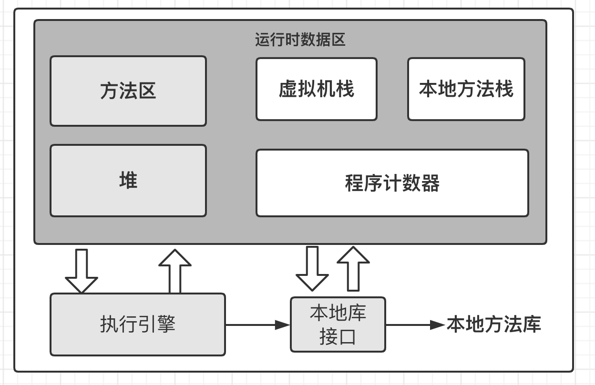

# 深入理解Java虚拟机

## 第二章：Java内存区域与内存溢出异常

在虚拟机自动内存管理机制下，不需要为每个new 操作去写配对的delete/free代码，不容易出现内存泄漏和内存溢出问题，一旦出现就很艰难了

### 运行时数据区域

Java虚拟机在执行Java程序时会把管理内存划分为若干个不同的数据区域，有些区域随着JVM的启动而存在，有些区域依赖用户线程启动结束而建立销毁，Java虚拟机规范规定了一下运行时数据区域

#### 程序计数器

程序计数器（PCR program Counter Register）是一块很小的区域，可以看作当前线程所执行的字节码的行号计数器，字节码解释器工作时就是通过改变这个计数器来选择下一条字节码指令，分支循环跳转异常处理线程恢复等基础功能都需要依赖于这个计数器。

由于多线程都是通过线程轮流切换分配处理器执行，所以每个线程都需要一个程序计数器，独立存储，这块区域是唯一一个JVM规范里面没有规定OutOfMemoryError的区域，执行Java方法，记录正在执行JVM字节码指令地址，执行Native方法，记录纸为空（Undefined）

#### 虚拟机栈

