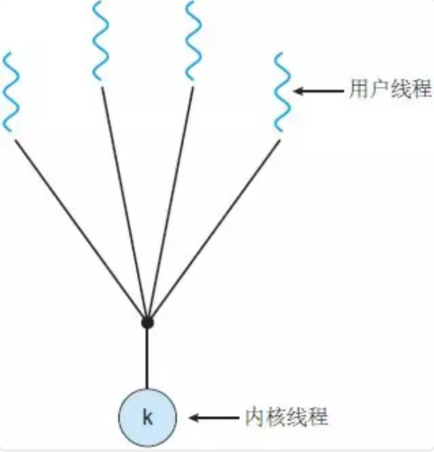
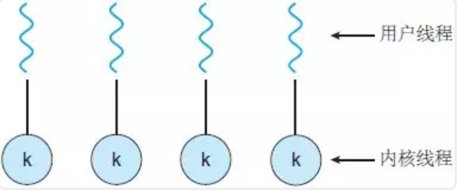

# 线程系列

在Java中，我们平时所说的并发编程、多线程、共享资源等概念都是与线程相关的，这里所说的线程实际上应该叫作“**用户线程**”，而对应到操作系统，还有另外一种线程叫作“**内核线程**”。

用户线程位于内核之上，它的管理无需内核支持；而内核线程由操作系统来直接支持与管理。几乎所有的现代操作系统，包括 Windows、Linux、Mac OS X 和 Solaris，都支持内核线程。

最终，用户线程和内核线程之间必然存在某种关系，本章我们一起来学习下建立这种关系常见的三种方法：多对一模型、一对一模型和多对多模型。

### 多对一模型

多对一线程模型，又叫作用户级线程模型，即多个用户线程对应到同一个内核线程上，线程的创建、调度、同步的所有细节全部由进程的用户空间线程库来处理。

**优点**

用户线程的很多操作对内核来说都是透明的，不需要用户态和内核态的频繁切换，使线程的创建、调度、同步等非常快

**缺点**

- 由于多个用户线程对应到同一个内核线程，如果其中一个用户线程阻塞，那么该其他用户线程也无法执行；

- 内核并不知道用户态有哪些线程，无法像内核线程一样实现较完整的调度、优先级等；

  

  **许多语言实现的协程库基本上都属于这种方式，比如python的geventf**

### 一对一模型

一对一模型，又叫作内核级线程模型，即一个用户线程对应一个内核线程，内核负责每个线程的调度，可以调度到其他处理器上面

**优点**

实现简单

**缺点**

- 对用户线程的大部分操作都会映射到内核线程上，引起用户态和内核态的频繁切换；
- 内核为每个线程都映射调度实体，如果系统出现大量线程，会对系统性能有影响；

**Java使用的就是一对一线程模型，所以在Java中启一个线程要谨慎**

### 多对多模型

多对多模型，又叫作两级线程模型，它是博采众长之后的产物，充分吸收前两种线程模型的优点且尽量规避它们的缺点。

在此模型下，用户线程与内核线程是多对多（m : n，通常m>=n）的映射模型。

首先，区别于多对一模型，多对多模型中的一个进程可以与多个内核线程关联，于是进程内的多个用户线程可以绑定不同的内核线程，这点和一对一模型相似；

其次，又区别于一对一模型，它的进程里的所有用户线程并不与内核线程一一绑定，而是可以动态绑定内核线程， 当某个内核线程因为其绑定的用户线程的阻塞操作被内核调度让出CPU时，其关联的进程中其余用户线程可以重新与其他内核线程绑定运行。

所以，多对多模型既不是多对一模型那种完全靠自己调度的也不是一对一模型完全靠操作系统调度的，而是中间态（自身调度与系统调度协同工作），因为这种模型的高度复杂性，操作系统内核开发者一般不会使用，所以更多时候是作为第三方库的形式出现。

**优点**

- 兼具多对一模型的轻量；
- 由于对应了多个内核线程，则一个用户线程阻塞时，其他用户线程仍然可以执行；
- 由于对应了多个内核线程，则可以实现较完整的调度、优先级等；

**缺点**

实现复杂

Go语言中的goroutine调度器就是采用的这种实现方案，在Go语言中一个进程可以启动成千上万个goroutine，这也是其出道以来就自带“高并发”光环的重要原因。

Java ForkJoinPool  **VS**  Go PMG

## 创建线程的8种方式

（1）继承Thread类并重写run()方法；

其本质还是直接实现的Runnable接口

（2）实现Runnable接口；

（3）匿名内部类；

对于JDK8 直接使用lambda表达式即可

（4）实现Callabe接口；

（5）定时器（java.util.Timer）；

（6）线程池；

（7）并行计算（Java8+）；

（8）Spring异步方法；

## 线程池

线程池，顾名思义它首先是一个“池”，这个池里面放的是线程，线程是用来执行任务的。

**首先**，线程池中的线程应该是有类别的，有的是核心线程，有的是非核心线程，所以我们需要两个变量标识核心线程数量coreSize和最大线程数量maxSize。

为什么要区分是否为核心线程呢？这是为了控制系统中线程的数量。

当线程池中线程数未达到核心线程数coreSize时，来一个任务加一个线程是可以的，也可以提高任务执行的效率。

当线程池中线程数达到核心线程数后，得控制一下线程的数量，来任务了先进队列，如果任务执行足够快，这些核心线程很快就能把队列中的任务执行完毕，完全没有新增线程的必要。

当队列中任务也满了，这时候光靠核心线程就无法及时处理任务了，所以这时候就需要增加新的线程了，但是线程也不能无限制地增加，所以需要控制其最大线程数量maxSize。

**其次**，我们需要一个任务队列来存放任务，这个队列必须是线程安全的，我们一般使用BlockingQueue阻塞队列来充当，当然使用ConcurrentLinkedQueue也是可以的（注意ConcurrentLinkedQueue不是阻塞队列，不能运用在jdk的线程池中）。

**最后**，当任务越来越多而线程处理却不及时，迟早会达到一种状态，队列满了，线程数也达到最大线程数了，这时候怎么办呢？这时候就需要走拒绝策略了，也就是这些无法及时处理的任务怎么办的一种策略，常用的策略有丢弃当前任务、丢弃最老的任务、调用者自己处理、抛出异常等。

**根据上面的描述**，我们定义一个线程池一共需要这么四个变量：核心线程数coreSize、最大线程数maxSize、阻塞队列BlockingQueue、拒绝策略RejectPolicy。

## ForkJoin

### 分治法

（1）二分搜索

（2）大整数乘法

（3）Strassen矩阵乘法

（4）棋盘覆盖

（5）归并排序

（6）快速排序

（7）线性时间选择

（8）汉诺塔

